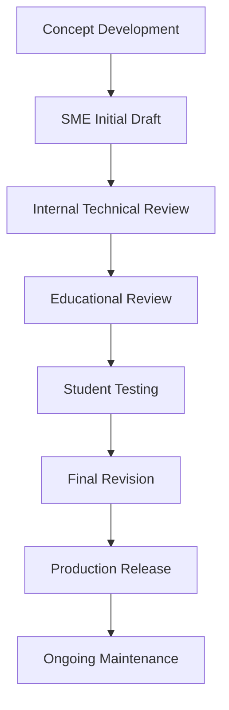
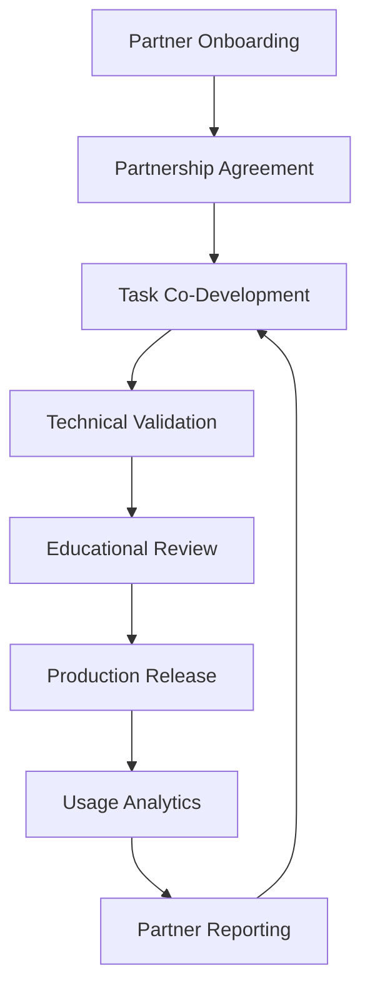

# Content Creation and Maintenance Pipeline

## Executive Summary
This document outlines the structured workflow for creating, evaluating, and maintaining high-quality practical coding tasks within the KodeLab platform. The pipeline ensures relevancy, technical accuracy, and educational effectiveness through a combination of expert review, automated assessment, and continuous feedback loops.

## 1. Structured Content Creation Workflow

### 1.1 Task Development Process



### 1.2 Role Definitions and Responsibilities

| Role | Responsibilities | Qualifications |
|------|------------------|---------------|
| **Subject Matter Expert (SME)** | Task concept development, initial draft creation, technical accuracy review | 5+ years industry experience in relevant domain, teaching experience preferred |
| **Educational Designer** | Learning objective alignment, difficulty calibration, feedback template design | Background in CS education, understanding of learning progression |
| **Technical Reviewer** | Code validation, solution testing, security review | 3+ years industry experience, strong testing background |
| **Student Tester** | Usability testing, clarity assessment, difficulty validation | Mix of skill levels to represent target audience |
| **Content Manager** | Workflow coordination, quality standards enforcement, final approval | Project management experience, technical background |

### 1.3 Task Template Structure

Each task must include the following components:

```yaml
task:
  metadata:
    id: unique-task-identifier
    title: "Task Title"
    created_date: "YYYY-MM-DD"
    last_updated: "YYYY-MM-DD"
    version: 1.0
    creators:
      - name: "Creator Name"
        role: "SME/Educational Designer"
    tags:
      - tag1
      - tag2
    difficulty: "beginner|intermediate|advanced|expert"
    estimated_time: 30  # minutes
  
  educational:
    learning_objectives:
      - "Objective 1"
      - "Objective 2"
    prerequisites:
      - "Prerequisite 1"
      - "Prerequisite 2"
    job_relevance:
      - role: "Backend Developer"
        relevance: 80  # percentage
      - role: "DevOps Engineer"
        relevance: 30  # percentage
  
  content:
    description: |
      Detailed task description...
    scenario: |
      Real-world context for the task...
    requirements:
      - "Requirement 1"
      - "Requirement 2"
    hints:
      - "Hint 1 (shown after X minutes)"
      - "Hint 2 (shown after failed attempt)"
  
  evaluation:
    test_cases:
      - name: "Test case 1"
        input: {}
        expected_output: {}
        hidden: false
      - name: "Test case 2"
        input: {}
        expected_output: {}
        hidden: true
    rubric:
      correctness: 40  # percentage weight
      efficiency: 20
      code_quality: 20
      security: 20
    feedback_templates:
      common_issues:
        - issue: "Issue description"
          recommendation: "Recommendation text"
  
  maintenance:
    review_frequency: "quarterly"
    technology_dependencies:
      - name: "Dependency 1"
        version: "^1.2.3"
    last_validated: "YYYY-MM-DD"
    freshness_score: 85  # percentage
```

### 1.4 Quality Criteria

Each task must meet the following quality criteria before release:

| Criterion | Success Metrics | Validation Method |
|-----------|----------------|-------------------|
| Technical Accuracy | All test cases pass, solution validated by 2+ reviewers | Technical review, automated testing |
| Educational Value | Aligned with learning objectives, builds relevant skills | Educational review, student feedback |
| Real-world Relevance | Scenario matches actual industry practices | SME validation, industry partner review |
| Clarity | >90% of student testers understand requirements | User testing, pilot feedback |
| Appropriate Difficulty | Completion time within 20% of estimate | User testing data, difficulty calibration |
| Security | No vulnerabilities in starter code or solution | Security scanning, review |

## 2. Automated Content Freshness Scoring System

### 2.1 Freshness Score Algorithm

The content freshness score (0-100) is calculated using the following weighted factors:

```python
def calculate_freshness_score(task):
    # Base factors
    time_factor = calculate_time_decay(task.last_updated)  # 0-100
    technology_relevance = assess_technology_currency(task.technology_dependencies)  # 0-100
    usage_metrics = evaluate_usage_patterns(task.id)  # 0-100
    feedback_quality = analyze_user_feedback(task.id)  # 0-100
    industry_alignment = check_industry_trends(task.tags, task.job_relevance)  # 0-100
    
    # Weighted calculation
    freshness_score = (
        time_factor * 0.2 +
        technology_relevance * 0.3 +
        usage_metrics * 0.15 +
        feedback_quality * 0.15 +
        industry_alignment * 0.2
    )
    
    return round(freshness_score)
```

### 2.2 Technology Trend Monitoring

The platform will automatically monitor technology trends through:

1. **API Integration**: Connections to GitHub, Stack Overflow, and tech news APIs to track emerging technologies
2. **Keyword Monitoring**: Regular analysis of trending keywords in job postings
3. **Framework Version Tracking**: Automated checks for new major releases of dependencies
4. **Industry Reports**: Quarterly processing of industry reports (e.g., Stack Overflow Developer Survey)

```python
def assess_technology_currency(dependencies):
    currency_scores = []
    
    for dependency in dependencies:
        latest_version = get_latest_version(dependency.name)
        version_age = calculate_version_age(dependency.version, latest_version)
        adoption_rate = get_technology_adoption_rate(dependency.name)
        
        # Calculate currency score for this dependency
        currency_score = 100 - (version_age * 0.6) - ((1 - adoption_rate) * 40)
        currency_scores.append(currency_score)
    
    # Return average currency score across all dependencies
    return sum(currency_scores) / len(currency_scores)
```

### 2.3 Automated Flagging System

Tasks will be automatically flagged for review based on the following triggers:

| Flag Type | Trigger Condition | Required Action | Timeline |
|-----------|------------------|----------------|----------|
| **Critical Update** | Freshness score < 60 or critical dependency update | SME review and update | Within 2 weeks |
| **Warning** | Freshness score 60-75 or declining user ratings | Content manager review | Within 1 month |
| **Scheduled Review** | Task approaching review date (3 years age) | Educational review | Within quarterly cycle |
| **Potential Optimization** | Completion rate < 65% or high abandonment | Educational designer review | Within 2 months |

### 2.4 Visualization and Reporting

The content management dashboard will include:

- Task library overview with freshness score distribution
- Visual indicators for flagged content
- Trend analysis of content health over time
- Prioritized list of tasks requiring attention
- Monthly content health reports

## 3. Content Partnership Program

### 3.1 Partner Types and Engagement Models

| Partner Type | Contribution Model | Benefits to Partner | Integration Method |
|--------------|-------------------|---------------------|-------------------|
| **Industry Professionals** | Task creation, technical review, scenario validation | Professional development, recruiting exposure, product education | Direct platform contribution, workshops |
| **Technology Companies** | Product-specific tasks, real-world scenarios, technical resources | Developer adoption, talent identification, platform exposure | API integration, partner portal |
| **Educational Institutions** | Academic task validation, learning progression guidance, research opportunities | Enhanced curriculum, student opportunities, research publication | LMS integration, joint research initiatives |
| **Open Source Projects** | Contribution-ready tasks, real maintenance scenarios | Contributor onboarding, community growth | GitHub integration, contribution pathways |

### 3.2 Partnership Workflow



### 3.3 Partner Portal Features

The partner portal will include:

- Task creation wizard with templates and guidelines
- Collaborative review workflow
- Analytics dashboard for partner-contributed content
- Recognition and attribution system
- Co-branding opportunities
- API documentation for technical integrations

### 3.4 Partner Recognition System

Partners will be recognized through:
- Visible attribution on tasks
- Partner profile on the platform
- Contribution metrics and impact data
- Annual recognition awards
- Joint case studies and testimonials

## 4. Rigorous Versioning System

### 4.1 Versioning Schema

Tasks will follow a semantic versioning approach:

```
MAJOR.MINOR.PATCH
```

- **MAJOR**: Incompatible changes to task requirements or evaluation criteria
- **MINOR**: Functionality additions that maintain backward compatibility
- **PATCH**: Bug fixes, clarifications, or minor improvements that don't affect requirements

### 4.2 Change Management Process

```python
def process_task_update(task_id, changes, change_type):
    """
    Manages the versioning and change tracking for tasks
    """
    current_task = get_task(task_id)
    
    # Determine version increment
    if change_type == "MAJOR":
        new_version = increment_major_version(current_task.version)
    elif change_type == "MINOR":
        new_version = increment_minor_version(current_task.version)
    else:  # PATCH
        new_version = increment_patch_version(current_task.version)
    
    # Create new version while preserving history
    updated_task = apply_changes(current_task, changes)
    updated_task.version = new_version
    updated_task.last_updated = current_date()
    updated_task.history.append({
        "previous_version": current_task.version,
        "change_date": current_date(),
        "change_type": change_type,
        "change_summary": summarize_changes(changes),
        "change_author": current_user()
    })
    
    # Store both versions
    archive_task_version(current_task)
    save_task(updated_task)
    
    # Notify affected users if major change
    if change_type == "MAJOR":
        notify_users_about_major_update(task_id, summarize_changes(changes))
    
    return updated_task
```

### 4.3 Backward Compatibility

The system will maintain backward compatibility through:

- Version-specific task storage
- User progress tracking by task version
- Migration paths for user work between compatible versions
- Historical version access for reference

### 4.4 Changelog Management

Each task will maintain a detailed changelog:

```json
{
  "task_id": "unique-task-identifier",
  "current_version": "2.3.1",
  "versions": [
    {
      "version": "2.3.1",
      "release_date": "2026-05-15",
      "change_type": "PATCH",
      "changes": [
        "Clarified second test case description",
        "Fixed typo in hint #3"
      ],
      "author": "Jane Smith"
    },
    {
      "version": "2.3.0",
      "release_date": "2026-04-20",
      "change_type": "MINOR",
      "changes": [
        "Added optional extension challenge",
        "Included new hint for efficiency optimization"
      ],
      "author": "John Doe"
    },
    {
      "version": "2.0.0",
      "release_date": "2026-02-10",
      "change_type": "MAJOR",
      "changes": [
        "Updated framework version from v3 to v4",
        "Changed API endpoint structure in requirements",
        "Revised evaluation criteria for security"
      ],
      "author": "Technical Review Team"
    }
  ]
}
```

## 5. Implementation Timeline

| Phase | Timeline | Key Deliverables |
|-------|----------|------------------|
| **Phase 1** | Q2 2025 | Structured task template, quality criteria, versioning schema |
| **Phase 2** | Q3 2025 | Content freshness algorithm, automated flagging system |
| **Phase 3** | Q4 2025 | Partner portal, initial partner onboarding |
| **Phase 4** | Q1 2026 | Advanced analytics, change management automation |

## 6. Success Metrics

| Metric | Current | Target (6 months) | Target (12 months) |
|--------|---------|-------------------|-------------------|
| Average content freshness score | N/A | 80+ | 85+ |
| Content requiring critical updates | N/A | <5% | <3% |
| Partner-contributed tasks | 0 | 15% of new content | 30% of new content |
| User-reported quality issues | N/A | <3% per task | <1% per task |
| Time from flagging to resolution | N/A | <14 days | <7 days |

This robust content creation and maintenance pipeline will ensure KodeLab delivers consistently relevant, high-quality learning experiences that directly prepare students for evolving industry needs.