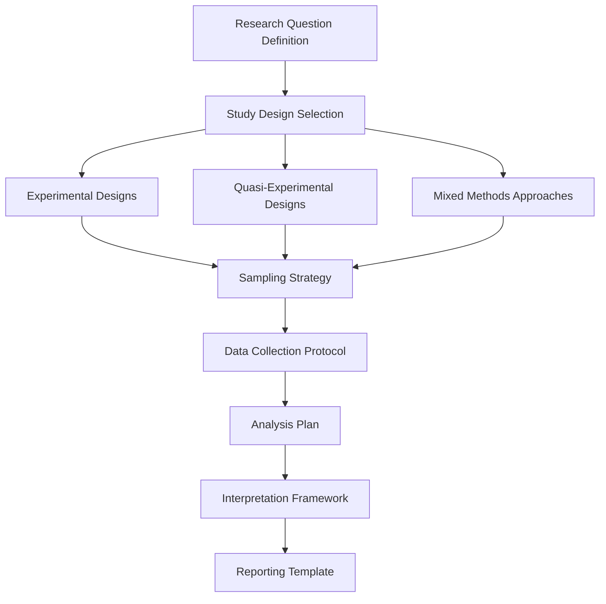
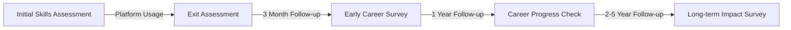

# Educational Effectiveness Validation

## Executive Summary
This document outlines KodeLab's comprehensive strategy for measuring, validating, and continuously improving the educational effectiveness of the platform. By implementing rigorous pre/post skill assessments, partnering with research institutions for third-party validation, tracking longitudinal career outcomes, and establishing an educational advisory board, KodeLab will demonstrate its impact on learning outcomes with empirical evidence and strengthen its position as a scientifically-validated educational solution.

## 1. Pre/Post Skill Assessment Framework

### 1.1 Assessment Design Principles

The skill assessment framework will be built on the following principles:

- **Authentic Assessment**: Measure practical application rather than knowledge recall
- **Construct Validity**: Ensure assessments accurately measure targeted skills
- **Reliability**: Produce consistent results across multiple administrations
- **Fairness**: Minimize bias and provide equal opportunity for all learners
- **Actionable Insights**: Generate data that informs targeted improvement

### 1.2 Assessment Structure

Develop a multi-faceted assessment approach that evaluates different skill dimensions:

#### 1.2.1 Practical Coding Assessment

```python
def evaluate_practical_skill(user_id, skill_domain, difficulty_level):
    """
    Administers a practical coding assessment and evaluates performance
    
    Parameters:
    - user_id: Unique identifier for the student
    - skill_domain: Specific skill area to assess (e.g., 'api_integration', 'database_optimization')
    - difficulty_level: Complexity level of assessment (1-5)
    
    Returns:
    - Assessment results with detailed metrics
    """
    # Select appropriate tasks for assessment
    assessment_tasks = task_selector.get_assessment_tasks(
        skill_domain=skill_domain,
        difficulty=difficulty_level,
        count=3,  # Multiple tasks for reliability
        randomize=True
    )
    
    # Create assessment session
    assessment_id = db.create_assessment_session(
        user_id=user_id,
        assessment_type="pre_post",
        skill_domain=skill_domain,
        start_time=datetime.now(),
        task_ids=[task.id for task in assessment_tasks]
    )
    
    # Execute assessment
    results = []
    for task in assessment_tasks:
        # Present task to student
        task_result = assessment_engine.administer_task(
            user_id=user_id,
            task_id=task.id,
            assessment_id=assessment_id,
            time_limit_minutes=30
        )
        
        results.append(task_result)
    
    # Analyze performance
    skill_score = assessment_analyzer.calculate_skill_score(results)
    
    # Store comprehensive results
    db.store_assessment_results(
        assessment_id=assessment_id,
        skill_score=skill_score,
        task_results=results,
        completion_time=datetime.now()
    )
    
    return {
        "assessment_id": assessment_id,
        "skill_domain": skill_domain,
        "difficulty_level": difficulty_level,
        "overall_score": skill_score.overall,
        "dimension_scores": {
            "correctness": skill_score.correctness,
            "efficiency": skill_score.efficiency,
            "code_quality": skill_score.code_quality,
            "problem_solving": skill_score.problem_solving
        },
        "time_taken_minutes": skill_score.time_taken,
        "completed_tasks": len(results),
        "detailed_results": results
    }
```

#### 1.2.2 Conceptual Understanding Assessment

Evaluate theoretical knowledge as a complement to practical skills:

- **Knowledge Application**: Scenarios requiring application of concepts
- **Pattern Recognition**: Identification of patterns in code or system designs
- **Error Analysis**: Detection and explanation of issues in provided code
- **Solution Evaluation**: Comparison of multiple approaches to a problem

#### 1.2.3 Self-Efficacy Measurement

Assess learner confidence and self-perception:

- **Skill Confidence Rating**: Self-assessment of ability in specific domains
- **Learning Growth Perception**: Perceived improvement over time
- **Career Readiness Confidence**: Self-assessed job preparedness
- **Challenge Comfort**: Willingness to tackle unfamiliar problems

### 1.3 Assessment Implementation Process

#### 1.3.1 Pre-Assessment Timeline

- Administered before beginning structured learning path
- Re-administered after significant platform updates
- Optional diagnostic assessments available on demand

#### 1.3.2 Interval Assessments

- Brief skill checks integrated into the learning journey
- Non-disruptive formative assessments during task completion
- Progress tracking with skill-specific micro-assessments

#### 1.3.3 Post-Assessment Design

- Administered after completion of learning paths
- Equivalent difficulty but different problems from pre-assessment
- Comprehensive evaluation across all targeted skill domains

### 1.4 Skill Growth Visualization

```javascript
// Radar chart visualization for skill growth
function renderSkillGrowthChart(canvasId, preData, postData, domains) {
  const ctx = document.getElementById(canvasId).getContext('2d');
  
  const data = {
    labels: domains,
    datasets: [
      {
        label: 'Pre-Assessment',
        data: preData,
        fill: true,
        backgroundColor: 'rgba(54, 162, 235, 0.2)',
        borderColor: 'rgb(54, 162, 235)',
        pointBackgroundColor: 'rgb(54, 162, 235)',
        pointBorderColor: '#fff',
        pointHoverBackgroundColor: '#fff',
        pointHoverBorderColor: 'rgb(54, 162, 235)'
      },
      {
        label: 'Post-Assessment',
        data: postData,
        fill: true,
        backgroundColor: 'rgba(75, 192, 192, 0.2)',
        borderColor: 'rgb(75, 192, 192)',
        pointBackgroundColor: 'rgb(75, 192, 192)',
        pointBorderColor: '#fff',
        pointHoverBackgroundColor: '#fff',
        pointHoverBorderColor: 'rgb(75, 192, 192)'
      }
    ]
  };
  
  const options = {
    elements: {
      line: {
        tension: 0.2
      }
    },
    scales: {
      r: {
        angleLines: {
          display: true
        },
        suggestedMin: 0,
        suggestedMax: 100
      }
    }
  };
  
  return new Chart(ctx, {
    type: 'radar',
    data: data,
    options: options
  });
}

// Growth trajectory visualization
function renderGrowthTrajectory(canvasId, timelineData, skill) {
  const ctx = document.getElementById(canvasId).getContext('2d');
  
  const annotations = timelineData.interventions.map(intervention => ({
    type: 'line',
    mode: 'vertical',
    scaleID: 'x',
    value: intervention.date,
    borderColor: 'rgba(255, 99, 132, 0.5)',
    borderWidth: A2,
    label: {
      content: intervention.label,
      enabled: true,
      position: 'top'
    }
  }));
  
  const data = {
    labels: timelineData.dates,
    datasets: [{
      label: `${skill} Skill Development`,
      data: timelineData.scores,
      fill: false,
      borderColor: 'rgb(75, 192, 192)',
      tension: 0.1
    }]
  };
  
  const options = {
    scales: {
      y: {
        beginAtZero: true,
        max: 100
      }
    },
    plugins: {
      annotation: {
        annotations: annotations
      }
    }
  };
  
  return new Chart(ctx, {
    type: 'line',
    data: data,
    options: options
  });
}
```

## 2. Research Partnerships Program

### 2.1 Partnership Framework

Establish formal research collaborations with academic institutions to conduct rigorous studies on KodeLab's educational effectiveness:

#### 2.1.1 Institution Selection Criteria

- Strong computer science education research programs
- Experience with educational technology evaluation
- Diverse student populations for generalizability
- Capability for longitudinal research
- Established publication track record

#### 2.1.2 Types of Research Partnerships

| Partnership Type | Duration | Research Focus | Institution Benefit |
|------------------|----------|----------------|---------------------|
| **Case Study** | 3-6 months | Implementation outcomes at specific institution | Free institutional license during study |
| **Comparative Study** | 6-12 months | KodeLab vs. traditional approaches | Research funding, co-authorship |
| **Longitudinal Study** | 2+ years | Long-term impact on student outcomes | Multi-year partnership, joint grant opportunities |
| **Experimental Trial** | 3-4 months | Controlled experiments on specific features | Early access to new features, custom functionality |

#### 2.1.3 Research Governance

Establish a formal framework for research integrity:

- **Ethics Review Process**: All research must pass institutional IRB
- **Data Security Protocol**: Clear guidelines for handling student data
- **Publication Agreement**: Open access to all research findings
- **Conflict of Interest Management**: Transparent disclosure of relationships

### 2.2 Sample Research Agenda

Develop a comprehensive research agenda addressing key questions:

#### 2.2.1 Effectiveness Studies

- **Comparative Learning Gains**: KodeLab vs. traditional instruction
- **Time-to-Proficiency**: Acceleration of skill acquisition
- **Retention Analysis**: Knowledge persistence over time
- **Transfer of Learning**: Application to novel problems
- **AI Feedback Impact**: Effect of AI vs. human feedback on learning

#### 2.2.2 Implementation Studies

- **Integration Models**: Best practices for curriculum integration
- **Faculty Adoption Patterns**: Factors influencing instructor uptake
- **Student Engagement Drivers**: Elements that increase platform use
- **Institutional Success Factors**: Organizational conditions for success

#### 2.2.3 Inclusive Education Studies

- **Equity Impact**: Effects across diverse student populations
- **Accessibility Effectiveness**: Outcomes for students with disabilities
- **Non-Traditional Student Success**: Effectiveness for career-changers
- **Global Applicability**: Cross-cultural effectiveness

### 2.3 Research Methods Framework

Provide partner institutions with a methodological toolkit:



#### 2.3.1 Mixed Methods Approach

Encourage research designs that combine multiple data sources:

- **Quantitative Performance Data**: Assessment scores, completion rates
- **Qualitative Experience Data**: Interviews, focus groups, reflections
- **Process Analytics**: Learning patterns, engagement metrics
- **Contextual Variables**: Environmental factors, implementation fidelity

#### 2.3.2 Standardized Measurement Tools

Provide validated instruments for consistent measurement:

- **Technical Skill Assessment**: Standardized practical evaluations
- **Learning Experience Survey**: Validated questionnaire for student experience
- **Implementation Fidelity Checklist**: Tool for measuring adherence to best practices
- **Faculty Experience Protocol**: Structured interview guide for instructors

### 2.4 Research Dissemination Strategy

Maximize the impact of research findings through strategic dissemination:

- **Peer-Reviewed Publications**: Target top-tier educational technology journals
- **Conference Presentations**: Regular presence at CS education conferences
- **Open Access Repository**: Public database of all research findings
- **Practitioner Briefs**: Accessible summaries for educational stakeholders
- **Annual Research Symposium**: Gathering of research partners to share findings

## 3. Longitudinal Career Outcome Tracking

### 3.1 Career Trajectory Monitoring System

Develop a comprehensive system to track graduate outcomes over time:

#### 3.1.1 Data Collection Approach



#### 3.1.2 Implementation Architecture

```python
class CareerOutcomeTracker:
    """
    System for tracking long-term career outcomes of platform users
    """
    def __init__(self, data_store, notification_service):
        self.data_store = data_store
        self.notification_service = notification_service
        self.survey_templates = self._load_survey_templates()
    
    def _load_survey_templates(self):
        """Load standardized survey instruments"""
        return {
            "exit": json.load(open("surveys/exit_assessment.json")),
            "3month": json.load(open("surveys/early_career.json")),
            "1year": json.load(open("surveys/career_progress.json")),
            "longterm": json.load(open("surveys/longterm_impact.json"))
        }
    
    def schedule_follow_ups(self, user_id, completion_date):
        """Schedule automated follow-up surveys"""
        self.data_store.create_follow_up_schedule(
            user_id=user_id,
            exit_date=completion_date,
            schedule=[
                {
                    "survey_type": "exit",
                    "scheduled_date": completion_date,
                    "completed": False
                },
                {
                    "survey_type": "3month",
                    "scheduled_date": completion_date + timedelta(days=90),
                    "completed": False
                },
                {
                    "survey_type": "1year",
                    "scheduled_date": completion_date + timedelta(days=365),
                    "completed": False
                },
                {
                    "survey_type": "longterm",
                    "scheduled_date": completion_date + timedelta(days=730),
                    "completed": False
                }
            ]
        )
    
    def send_survey_invitation(self, user_id, survey_type):
        """Send survey invitation to user"""
        user = self.data_store.get_user(user_id)
        survey_template = self.survey_templates[survey_type]
        
        # Generate unique survey link with pre-populated user ID
        survey_url = self._generate_survey_url(user_id, survey_type)
        
        # Send notification
        self.notification_service.send_email(
            recipient=user.email,
            subject=f"KodeLab Career Survey: {survey_template['title']}",
            template="career_survey_invitation",
            context={
                "user_name": user.name,
                "survey_title": survey_template["title"],
                "survey_description": survey_template["description"],
                "estimated_time": survey_template["estimated_minutes"],
                "survey_url": survey_url,
                "incentive_description": survey_template["incentive"]
            }
        )
        
        # Update record
        self.data_store.log_survey_invitation(user_id, survey_type, datetime.now())
    
    def process_survey_response(self, user_id, survey_type, responses):
        """Process and store survey responses"""
        # Validate responses against schema
        self._validate_responses(responses, self.survey_templates[survey_type]["schema"])
        
        # Store responses
        self.data_store.store_survey_responses(
            user_id=user_id,
            survey_type=survey_type,
            response_date=datetime.now(),
            responses=responses
        )
        
        # Mark as completed in schedule
        self.data_store.update_follow_up_status(user_id, survey_type, True)
        
        # Issue incentive if applicable
        if "incentive" in self.survey_templates[survey_type]:
            self._issue_incentive(user_id, self.survey_templates[survey_type]["incentive"])
    
    def generate_cohort_report(self, cohort_definition, time_period):
        """Generate report on career outcomes for a cohort"""
        # Identify users in cohort
        cohort_users = self.data_store.query_users(cohort_definition)
        
        # Gather survey data
        survey_data = {}
        for survey_type in self.survey_templates.keys():
            survey_data[survey_type] = self.data_store.get_survey_responses(
                user_ids=[u.id for u in cohort_users],
                survey_type=survey_type,
                time_period=time_period
            )
        
        # Calculate metrics
        metrics = self._calculate_outcome_metrics(survey_data, cohort_users)
        
        # Generate visualizations
        visualizations = self._generate_outcome_visualizations(metrics)
        
        return {
            "cohort_size": len(cohort_users),
            "response_rates": {st: len(data)/len(cohort_users) for st, data in survey_data.items()},
            "metrics": metrics,
            "visualizations": visualizations,
            "generation_date": datetime.now()
        }
```

#### 3.1.3 Career Outcome Metrics

Track a comprehensive set of career progression indicators:

- **Employment Rate**: Percentage of graduates employed in technical roles
- **Role Alignment**: Match between skills taught and job requirements
- **Time-to-Employment**: Average duration from completion to job placement
- **Starting Compensation**: Initial salary and benefits package
- **Career Progression**: Promotion rate compared to industry average
- **Employer Satisfaction**: Feedback from hiring organizations
- **Further Education**: Pursuit of additional technical credentials
- **Job Satisfaction**: Self-reported career satisfaction metrics

### 3.2 User vs. Non-User Comparative Analysis

Establish a methodology for comparing outcomes between platform users and non-users:

#### 3.2.1 Matching Methodology

Develop a propensity-score matching approach to create comparable cohorts:

- **Demographic Matching**: Age, gender, prior education
- **Academic Matching**: GPA, institution type, program of study
- **Prior Experience Matching**: Previous technical background
- **Career Goal Matching**: Target industry and role

#### 3.2.2 Comparative Metrics

Analyze key differential outcomes:

- **Interview Success Rate**: Percentage advancing past technical interviews
- **Offer Conversion**: Job offers received per application
- **Onboarding Duration**: Time to productivity in new role
- **Performance Reviews**: Early job performance evaluations
- **Career Resilience**: Job stability during economic fluctuations
- **Skill Relevance**: Self-reported preparedness for job requirements

#### 3.2.3 Differential Analysis Visualization

```javascript
// Comparative outcome visualization
function renderComparativeOutcomes(canvasId, kodelabData, controlData, metrics) {
  const ctx = document.getElementById(canvasId).getContext('2d');
  
  const data = {
    labels: metrics,
    datasets: [
      {
        label: 'KodeLab Users',
        data: kodelabData,
        backgroundColor: 'rgba(75, 192, 192, 0.7)',
        borderWidth: 0
      },
      {
        label: 'Non-Users',
        data: controlData,
        backgroundColor: 'rgba(54, 162, 235, 0.7)',
        borderWidth: 0
      }
    ]
  };
  
  const options = {
    indexAxis: 'y',
    scales: {
      x: {
        beginAtZero: true,
        title: {
          display: true,
          text: 'Percentage of Graduates (%)'
        }
      }
    },
    plugins: {
      legend: {
        position: 'top',
      },
      tooltip: {
        callbacks: {
          label: function(context) {
            return `${context.dataset.label}: ${context.parsed.x}%`;
          }
        }
      }
    }
  };
  
  return new Chart(ctx, {
    type: 'bar',
    data: data,
    options: options
  });
}
```

### 3.3 Employer Feedback Integration

Establish systematic employer feedback channels:

#### 3.3.1 Employer Survey Framework

Regular data collection from hiring organizations:

- **Onboarding Assessment**: Evaluation of graduate readiness
- **Skill Gap Analysis**: Identification of any missing competencies
- **Performance Comparison**: KodeLab users vs. traditional graduates
- **Hiring Preference**: Impact on future recruiting decisions

#### 3.3.2 Hiring Manager Interview Protocol

Structured qualitative feedback from direct supervisors:

- **Technical Readiness**: Preparation for actual job tasks
- **Collaboration Skills**: Team integration and communication
- **Learning Agility**: Adaptation to new technologies and challenges
- **Productivity Trajectory**: Time to full productivity

#### 3.3.3 Industry Advisory Input

Regular reviews of outcome data by industry representatives:

- **Relevance Assessment**: Alignment with evolving industry needs
- **Forward-looking Recommendations**: Emerging skill requirements
- **Benchmark Comparisons**: Performance against industry expectations

## 4. Educational Advisory Board

### 4.1 Board Structure and Composition

Establish a diverse advisory board to guide educational strategy:

#### 4.1.1 Membership Composition

| Role | Expertise | Representation Target |
|------|-----------|----------------------|
| **Academic Leaders** | CS Education Research, Curriculum Design | 35% of board |
| **Industry Practitioners** | Current Technical Leadership, Hiring | 35% of board |
| **Educational Technology Experts** | Online Learning, Educational Assessment | 15% of board |
| **Student/Graduate Representatives** | Learner Experience, Career Transition | 15% of board |

#### 4.1.2 Selection Criteria

- **Demonstrated Expertise**: Recognized contributions to relevant field
- **Diverse Perspectives**: Varied institutional and demographic backgrounds
- **Forward-thinking Approach**: Innovation-oriented mindset
- **Collaborative Spirit**: Willingness to engage constructively
- **Time Commitment**: Ability to participate actively

#### 4.1.3 Governance Structure

- **Term Limits**: 2-year terms with option for one renewal
- **Meeting Cadence**: Quarterly virtual meetings, annual in-person summit
- **Working Groups**: Topic-specific subcommittees as needed
- **Reporting Structure**: Advisory relationship to executive leadership
- **Conflict of Interest Policy**: Clear guidelines for disclosure and recusal

### 4.2 Advisory Board Functions

#### 4.2.1 Educational Quality Oversight

Provide expert guidance on educational effectiveness:

- **Curriculum Review**: Evaluate learning path design and progression
- **Assessment Validation**: Review measurement approaches and instruments
- **Pedagogical Innovation**: Recommend emerging educational approaches
- **Quality Standards**: Establish benchmarks for platform excellence

#### 4.2.2 Research Guidance

Steer the research agenda and methodologies:

- **Research Priority Setting**: Identify key questions for investigation
- **Methodology Review**: Advise on research design and approaches
- **Partnership Development**: Identify potential research collaborators
- **Evidence Evaluation**: Assess strength of findings and implications

#### 4.2.3 Industry Alignment

Ensure educational offerings match workforce needs:

- **Skill Gap Analysis**: Identify emerging technical requirements
- **Job Role Mapping**: Connect learning paths to career opportunities
- **Industry Trend Forecasting**: Anticipate future technical directions
- **Employer Feedback Integration**: Interpret recruitment needs

#### 4.2.4 Educational Impact Amplification

Maximize the platform's educational influence:

- **Best Practice Dissemination**: Share implementation strategies
- **Educational Community Engagement**: Connect to broader initiatives
- **Policy Alignment**: Relate to educational policy developments
- **Cross-sector Collaboration**: Identify partnership opportunities

### 4.3 Annual Educational Impact Report

Produce a comprehensive annual report synthesizing all validation efforts:

#### 4.3.1 Report Structure

- **Executive Summary**: Key findings and strategic implications
- **Learning Outcomes Analysis**: Aggregated pre/post assessment results
- **Research Study Summaries**: Findings from formal research partnerships
- **Career Outcome Trends**: Longitudinal tracking results
- **Industry Alignment Assessment**: Match to current job requirements
- **Educational Innovation Highlights**: New approaches and their impact
- **Advisory Board Recommendations**: Forward-looking guidance

#### 4.3.2 Data Visualization Strategy

```javascript
// Dashboard visualization for educational impact
function renderEducationalImpactDashboard(container, impactData) {
  // Skill improvement visualization
  const skillGrowthChart = renderSkillGrowthChart(
    'skill-growth-canvas',
    impactData.preAssessment.averages,
    impactData.postAssessment.averages,
    impactData.skillDomains
  );
  
  // Career outcome visualization
  const careerOutcomeChart = renderComparativeOutcomes(
    'career-outcomes-canvas',
    impactData.careerOutcomes.kodelabUsers,
    impactData.careerOutcomes.industryAverage,
    impactData.careerOutcomes.metrics
  );
  
  // Engagement metrics
  const engagementChart = renderEngagementMetrics(
    'engagement-canvas',
    impactData.engagement.timeline,
    impactData.engagement.metrics
  );
  
  // Satisfaction scores
  const satisfactionChart = renderSatisfactionScores(
    'satisfaction-canvas',
    impactData.satisfaction.categories,
    impactData.satisfaction.scores,
    impactData.satisfaction.benchmark
  );
  
  // Create interactive filters
  createDashboardFilters(container, {
    timeRange: impactData.availableTimeRanges,
    userGroups: impactData.availableUserGroups,
    skillDomains: impactData.skillDomains
  }, function(filters) {
    // Update all visualizations based on filter selection
    updateDashboardData(filters, [
      skillGrowthChart,
      careerOutcomeChart,
      engagementChart,
      satisfactionChart
    ]);
  });
}
```

#### 4.3.3 Distribution Strategy

Maximize impact through strategic dissemination:

- **Public Accessibility**: Report available on platform website
- **Stakeholder Briefings**: Tailored presentations for key audiences
- **Press Strategy**: Media outreach highlighting key findings
- **Academic Presentation**: Submission to educational conferences
- **Industry Showcases**: Targeted sharing with employer partners

## 5. Implementation Timeline

| Phase | Timeline | Key Deliverables |
|-------|----------|------------------|
| **Phase 1** | Q2 2025 | Pre/post assessment framework, Educational advisory board formation |
| **Phase 2** | Q3 2025 | Initial research partnerships (3-5 institutions), Baseline data collection |
| **Phase 3** | Q4 2025 | Career outcome tracking system, Preliminary effectiveness studies |
| **Phase 4** | Q1 2026 | Comparative analysis framework, Research partnership expansion |
| **Phase 5** | Q2 2026 | First annual educational impact report, Initial longitudinal data |

## 6. Success Metrics

| Metric | Current | Target (6 months) | Target (12 months) |
|--------|---------|-------------------|-------------------|
| Pre/post skill assessments completed | 0 | 1,000+ | 5,000+ |
| Average skill improvement | N/A | 20%+ | 30%+ |
| Research partnerships | 0 | 5 | 12 |
| Published studies | 0 | 1 | 4 |
| Longitudinal tracking enrollment | 0% | 30% of graduates | 60% of graduates |
| Career data points collected | 0 | 10,000+ | 50,000+ |
| Advisory board establishment | 0% | 100% | 100% + 2 working groups |
| Educational impact report | Not started | Framework complete | First report published |

## 7. Resource Requirements

To support the educational effectiveness validation strategy, the following resources will be required:

- **Personnel**: 
  - 1 Educational Research Director (new hire in Q2 2025)
  - 1 Learning Assessment Specialist (new hire in Q2 2025)
  - 1 Data Scientist specializing in educational analytics (new hire in Q3 2025)
  - Part-time Research Coordinator (20 hours/week, Q3 2025)
  
- **Technology**: 
  - Learning analytics platform with assessment capabilities
  - Longitudinal survey and tracking system
  - Data visualization and reporting tools
  
- **Partnerships Budget**:
  - Research grant funding: $150,000 annually
  - Advisory board operations: $75,000 annually
  - Conference and publication support: $50,000 annually
  
- **Budget Impact**:
  - New hires: $380,000 annually
  - Technology investments: $120,000 one-time, $40,000 annually
  - Partnership funding: $275,000 annually
  - Total additional budget: $500,000 first year, $695,000 annually thereafter

This comprehensive educational effectiveness validation strategy will provide KodeLab with empirical evidence of its impact, strengthen its credibility with educational institutions and employers, and establish a continuous improvement cycle based on rigorous research and expert guidance.