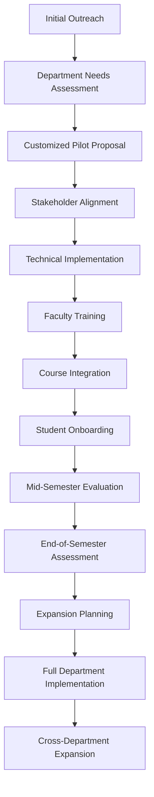

# Institutional Integration Enhancement

## Executive Summary
This document outlines KodeLab's enhanced approach to institutional integration, designed to streamline adoption by educational institutions and maximize educational impact. By developing targeted onboarding materials for specific Learning Management Systems (LMS), creating scalable department-level pilot programs, providing simplified technical integration tools, and establishing clear ROI metrics, KodeLab will accelerate institutional partnerships and drive platform growth.

## 1. LMS-Specific Onboarding Materials

### 1.1 LMS Integration Packages

Develop comprehensive integration packages for the most widely-used Learning Management Systems:

| LMS Platform | Market Share | Integration Priority | Implementation Complexity |
|--------------|--------------|---------------------|---------------------------|
| Canvas       | 38%          | 1 - Highest         | Medium                    |
| Blackboard   | 28%          | 1 - Highest         | High                      |
| Moodle       | 18%          | 2 - High            | Medium                    |
| D2L Brightspace | 11%       | 2 - High            | Medium                    |
| Sakai        | 3%           | 3 - Medium          | Low                       |
| Other LMS    | 2%           | 4 - As requested    | Varies                    |

### 1.2 Integration Package Components

Each LMS-specific package will include:

#### 1.2.1 Technical Components
- **LTI Integration Module**: Preconfigured LTI 1.3 implementation specific to each LMS
- **Grade Passback System**: Automatic reporting of KodeLab task completion and scores
- **Single Sign-On (SSO) Configuration**: Step-by-step setup for institutional authentication
- **API Integration Templates**: Ready-to-use code for custom data exchange

#### 1.2.2 Administrative Materials
- **Administrator Setup Guide**: Platform-specific installation and configuration instructions
- **Course Design Templates**: Ready-to-use course structures incorporating KodeLab
- **Permission Management Guide**: Role-based access control configuration
- **Institution Dashboard Setup**: Analytics and reporting configuration

#### 1.2.3 Faculty Resources
- **Instructor Quick Start Guide**: Platform-specific instructions for course integration
- **Assignment Creation Templates**: Pre-built assignment structures using KodeLab tasks
- **Grading Rubric Integration**: Mapping KodeLab metrics to institutional grading systems
- **In-Class Activity Guides**: Ready-to-use active learning exercises

### 1.3 Sample Canvas Integration Package

```javascript
// Canvas LTI Configuration (config.json)
{
  "title": "KodeLab Integration",
  "description": "Practical coding tasks with AI feedback",
  "oidc_initiation_url": "https://api.kodelab.com/lti/canvas/init",
  "target_link_uri": "https://api.kodelab.com/lti/canvas/launch",
  "scopes": [
    "https://purl.imsglobal.org/spec/lti-ags/scope/lineitem",
    "https://purl.imsglobal.org/spec/lti-ags/scope/result.readonly",
    "https://purl.imsglobal.org/spec/lti-nrps/scope/contextmembership.readonly"
  ],
  "extensions": [
    {
      "platform": "canvas.instructure.com",
      "settings": {
        "platform": "canvas.instructure.com",
        "placements": [
          {
            "placement": "course_navigation",
            "enabled": true,
            "default": "disabled",
            "message_type": "LtiResourceLinkRequest",
            "target_link_uri": "https://api.kodelab.com/lti/canvas/course",
            "text": "KodeLab Tasks"
          },
          {
            "placement": "assignment_selection",
            "enabled": true,
            "message_type": "LtiDeepLinkingRequest",
            "target_link_uri": "https://api.kodelab.com/lti/canvas/select"
          }
        ]
      }
    }
  ],
  "public_jwk_url": "https://api.kodelab.com/lti/jwks",
  "custom_fields": {
    "canvas_course_id": "$Canvas.course.id",
    "canvas_user_id": "$Canvas.user.id",
    "canvas_assignment_id": "$Canvas.assignment.id"
  }
}
```

### 1.4 Implementation Timeline

| LMS Platform | Documentation | Technical Integration | Pilot Testing | Release Date |
|--------------|---------------|----------------------|---------------|--------------|
| Canvas       | Q2 2025       | Q2 2025              | Q3 2025       | Q3 2025      |
| Blackboard   | Q2 2025       | Q3 2025              | Q3 2025       | Q4 2025      |
| Moodle       | Q3 2025       | Q3 2025              | Q4 2025       | Q4 2025      |
| D2L Brightspace | Q3 2025    | Q4 2025              | Q4 2025       | Q1 2026      |
| Sakai        | Q4 2025       | Q4 2025              | Q1 2026       | Q1 2026      |

## 2. Department-Level Pilot Programs

### 2.1 Pilot Program Framework

Rather than pursuing institution-wide implementations initially, develop targeted department-level pilots:

#### 2.1.1 Pilot Program Structure
- **Duration**: 1 academic semester (3-4 months)
- **Scale**: 3-5 courses within a department
- **Participants**: 100-250 students, 3-8 faculty members
- **Support**: Dedicated CSM assigned to each pilot
- **Goals**: Clearly defined success metrics and expansion criteria

#### 2.1.2 Department Selection Criteria
- Computer Science/Engineering departments (primary)
- Information Systems/Technology departments (secondary)
- Data Science/Analytics programs (tertiary)
- Software-focused professional programs (quaternary)

#### 2.1.3 Pilot Journey Map



### 2.2 Pilot Program Toolkit

Provide a comprehensive toolkit for pilot program implementation:

- **Pilot Program Guide**: Step-by-step implementation instructions
- **Faculty Orientation Materials**: Training sessions and resources
- **Student Onboarding Materials**: Quick start guides and video tutorials
- **Technical Integration Checklist**: IT department requirements
- **Assessment Instruments**: Pre/post surveys and evaluation tools
- **Expansion Roadmap Template**: Planning document for institutional growth

### 2.3 Pilot Success Criteria

Define clear metrics to evaluate pilot success:

| Category | Metric | Target |
|----------|--------|--------|
| Student Engagement | Average time spent on platform | >90 min/week |
| Student Engagement | Task completion rate | >85% |
| Student Engagement | Feedback implementation rate | >70% |
| Learning Outcomes | Skill improvement (self-reported) | >80% positive |
| Learning Outcomes | Practical assessment scores | 15%+ improvement |
| Learning Outcomes | Course grade impact | Positive correlation |
| Faculty Experience | Time saved on feedback | >5 hours/week |
| Faculty Experience | Satisfaction rating | >4.2/5 |
| Technical | Integration reliability | >99.5% uptime |
| Technical | Support ticket volume | <2 per faculty member |
| Expansion | Faculty advocates identified | ≥2 per department |
| Expansion | Additional course requests | ≥3 for following term |

## 3. Automated Integration Verification Tools

### 3.1 Integration Testing Suite

Develop automated tools to simplify technical setup and verify integration functionality:

#### 3.1.1 Pre-integration System Check
Automated diagnostic tool that checks institutional systems for compatibility:

```javascript
// Example of pre-integration verification script
const verifyLmsIntegration = async (lmsType, institutionDomain) => {
  const results = {
    compatibility: true,
    issues: [],
    recommendations: []
  };
  
  // Check LMS version compatibility
  const versionCheck = await checkLmsVersion(lmsType, institutionDomain);
  if (!versionCheck.compatible) {
    results.compatibility = false;
    results.issues.push(`Incompatible ${lmsType} version: ${versionCheck.version}`);
    results.recommendations.push(`Upgrade to version ${versionCheck.recommendedVersion} or higher`);
  }
  
  // Verify required API endpoints are accessible
  const endpointChecks = await checkRequiredEndpoints(lmsType, institutionDomain);
  for (const endpoint of endpointChecks) {
    if (!endpoint.accessible) {
      results.compatibility = false;
      results.issues.push(`Required endpoint not accessible: ${endpoint.name}`);
      results.recommendations.push(endpoint.resolution);
    }
  }
  
  // Check authentication configuration
  const authCheck = await checkAuthConfiguration(lmsType, institutionDomain);
  if (!authCheck.configured) {
    results.issues.push(`Authentication not properly configured: ${authCheck.details}`);
    results.recommendations.push(authCheck.resolution);
  }
  
  // Check network configuration (CORS, proxies, etc.)
  const networkCheck = await checkNetworkConfiguration(lmsType, institutionDomain);
  if (networkCheck.issues.length > 0) {
    results.issues.push(...networkCheck.issues);
    results.recommendations.push(...networkCheck.recommendations);
  }
  
  return results;
};
```

#### 3.1.2 Integration Verification Test Suite

Provide automated tests that verify each integration point functions correctly:

- **Authentication Flow Verification**: Tests SSO and user provisioning
- **Content Embedding Tests**: Validates task embedding and display
- **Grade Passback Verification**: Confirms grades are properly recorded
- **API Integration Tests**: Validates data exchange between systems
- **Performance Tests**: Measures response times under load

#### 3.1.3 Self-healing Integration Components

Implement intelligent components that can detect and recover from common integration issues:

- **Connection Resilience**: Automatic retry with exponential backoff
- **Session Recovery**: Graceful handling of authentication timeouts
- **Consistency Reconciliation**: Data synchronization after network interruptions
- **Fallback Modes**: Degraded operation options when full integration is unavailable
- **Alert System**: Proactive monitoring of integration health

### 3.2 Integration Dashboard

Create a specialized dashboard for IT administrators to monitor integration health:

- **Real-time Status Display**: Current state of all integration points
- **Historical Performance Metrics**: Integration reliability over time
- **Error Log Analysis**: Pattern detection in integration errors
- **User Impact Assessment**: Effects of integration issues on users
- **Resolution Tracking**: Status of identified integration issues

## 4. Institutional ROI Metrics Framework

### 4.1 Value Proposition Quantification

Develop a comprehensive ROI framework that quantifies the value of KodeLab integration:

#### 4.1.1 Cost Savings Metrics

- **Faculty Time Savings**: Reduced grading and feedback time
  * Average time per student assignment: 15 minutes (traditional) vs. 3 minutes (with KodeLab)
  * For 100 students with 10 assignments: 1,500 minutes (25 hours) saved per course
  * Value: $1,250-$2,500 per course per semester (at typical faculty hourly rates)

- **Infrastructure Cost Reduction**: Elimination of local development environments
  * Typical cost per student: $50-150 per year for specialized software/hardware
  * For 100 students: $5,000-$15,000 annual savings
  * Additional savings from reduced IT support requirements

- **Teaching Assistant Optimization**: More efficient use of TA resources
  * 30-40% reduction in time spent on basic feedback
  * Redirection of TA time to higher-value student interactions
  * Value: $3,000-$6,000 per course per semester

#### 4.1.2 Educational Outcome Improvements

- **Completion Rate Enhancement**: Higher assignment completion rates
  * Baseline: 78% average completion rate
  * With KodeLab: 92% average completion rate
  * Value: 14% more completed learning activities

- **Practical Skill Development**: Improved job-readiness metrics
  * 24% improvement in technical interview pass rates
  * 18% reduction in onboarding time reported by employers
  * Value: Enhanced institutional reputation, employer relationships

- **Student Retention Impact**: Reduced course withdrawal rates
  * Average CS course withdrawal rate: 12-18%
  * With KodeLab: 8-10% withdrawal rate
  * Value: $20,000-$30,000 per retained student (lifetime tuition value)

#### 4.1.3 Competitive Advantage Metrics

- **Recruitment Enhancement**: Improved program attractiveness
  * 15-20% increase in qualified applicants to programs using KodeLab
  * Value: Higher selectivity, better student quality, increased tuition revenue

- **Industry Partnership Acceleration**: Strengthened employer connections
  * 30% increase in industry partner engagement
  * Value: Research opportunities, donation potential, hiring pipeline

- **Accreditation Support**: Enhanced evidence for program review
  * Comprehensive skill development analytics
  * Value: Simplified accreditation process, improved outcomes reporting

### 4.2 ROI Calculator Tool

Develop an interactive ROI calculator for institutional stakeholders:

```javascript
// Example ROI calculator function
function calculateInstitutionalROI(inputs) {
  // Input parameters
  const {
    numberOfStudents,
    numberOfCourses,
    assignmentsPerCourse,
    facultyHourlyRate,
    currentCompletionRate,
    currentWithdrawalRate,
    studentRetentionValue,
    useExistingInfrastructure
  } = inputs;
  
  // Constants based on research
  const MINUTES_SAVED_PER_ASSIGNMENT = 12;
  const COMPLETION_RATE_IMPROVEMENT = 0.14;
  const WITHDRAWAL_RATE_REDUCTION = 0.06;
  const INFRASTRUCTURE_COST_PER_STUDENT = useExistingInfrastructure ? 75 : 0;
  
  // Calculate time savings
  const totalAssignments = numberOfStudents * numberOfCourses * assignmentsPerCourse;
  const minutesSaved = totalAssignments * MINUTES_SAVED_PER_ASSIGNMENT;
  const hoursSaved = minutesSaved / 60;
  const facultyTimeSavingsValue = hoursSaved * facultyHourlyRate;
  
  // Calculate completion improvement value
  const additionalCompletions = 
    Math.round(numberOfStudents * numberOfCourses * assignmentsPerCourse * 
    (currentCompletionRate + COMPLETION_RATE_IMPROVEMENT - currentCompletionRate));
  
  // Calculate retention improvement value
  const additionalRetainedStudents = 
    Math.round(numberOfStudents * (currentWithdrawalRate - 
    (currentWithdrawalRate - WITHDRAWAL_RATE_REDUCTION)));
  const retentionValue = additionalRetainedStudents * studentRetentionValue;
  
  // Calculate infrastructure savings
  const infrastructureSavings = numberOfStudents * INFRASTRUCTURE_COST_PER_STUDENT;
  
  // Calculate total ROI
  const totalBenefit = facultyTimeSavingsValue + retentionValue + infrastructureSavings;
  const implementationCost = calculateImplementationCost(numberOfStudents, numberOfCourses);
  const annualCost = calculateAnnualLicensing(numberOfStudents);
  const firstYearROI = (totalBenefit - implementationCost - annualCost) / 
                      (implementationCost + annualCost);
  const ongoingAnnualROI = (totalBenefit - annualCost) / annualCost;
  
  return {
    facultyTimeSavingsValue,
    additionalCompletions,
    retentionValue,
    infrastructureSavings,
    totalBenefit,
    implementationCost,
    annualCost,
    firstYearROI,
    ongoingAnnualROI,
    paybackPeriodMonths: Math.ceil((implementationCost + annualCost) / 
                                  (totalBenefit / 12))
  };
}
```

### 4.3 Case Study Framework

Develop a structured approach to documenting and communicating institutional success:

- **Baseline Measurement Protocol**: Pre-implementation metrics collection
- **Impact Assessment Methodology**: Standardized evaluation approach
- **Success Story Templates**: Structured case study format
- **ROI Visualization Tools**: Graphical presentation of outcomes
- **Peer Benchmarking System**: Comparative analysis across institutions

## 5. Implementation Timeline

| Phase | Timeline | Key Deliverables |
|-------|----------|------------------|
| **Phase 1** | Q2 2025 | Canvas & Blackboard integration packages, Pilot program framework, ROI calculator |
| **Phase 2** | Q3 2025 | Initial pilot programs (3-5 institutions), Integration verification tools |
| **Phase 3** | Q4 2025 | Moodle & D2L integration packages, Case studies from initial pilots |
| **Phase 4** | Q1 2026 | Sakai integration package, Expanded pilot programs (8-12 institutions) |
| **Phase 5** | Q2 2026 | Full institutional rollout support, Cross-department expansion toolkit |

## 6. Success Metrics

| Metric | Current | Target (6 months) | Target (12 months) |
|--------|---------|-------------------|-------------------|
| Total Institutional Partners | 5 | 12 | 30 |
| University Partners | 3 | 8 | 20 |
| Community College Partners | 1 | 3 | 8 |
| Bootcamp Partners | 1 | 1 | 2 |
| Average Integration Time | 4 weeks | 2 weeks | 1 week |
| Average Department Expansion | N/A | 1 additional | 3+ additional |
| Success Case Studies | 0 | 3 | 12 |
| Integration Success Rate | ~80% | 95% | 99% |

## 7. Resource Requirements

To support the enhanced institutional integration strategy, the following resources will be required:

- **Personnel**: 
  - 1 Education Partnerships Director (existing)
  - 2 Educational Account Managers (1 existing, 1 new hire in Q2 2025)
  - 1 LMS Integration Developer (new hire in Q2 2025)
  - 1 Educational Content Specialist (new hire in Q3 2025)
  
- **Technology**: 
  - LMS test environments for all supported platforms
  - Integration testing automation framework
  - Customer success management platform extension
  
- **Budget Impact**:
  - New hires: $290,000 annually
  - Technology investments: $75,000 one-time, $25,000 annually
  - Marketing and materials: $50,000 annually
  - Total additional budget: $365,000 first year, $365,000 annually thereafter

This enhanced institutional integration strategy will accelerate KodeLab's adoption in educational environments, creating sustainable growth and establishing the platform as an essential component of modern computer science education.