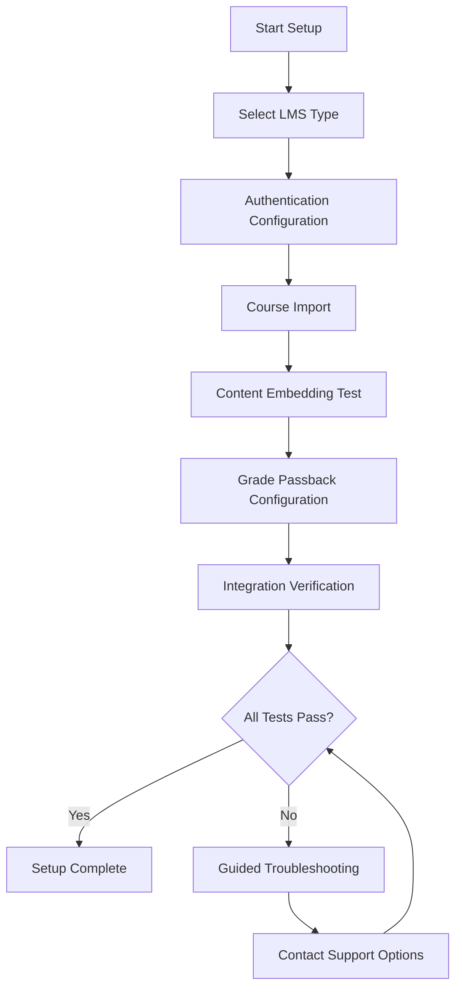

# Institutional Integration Enhancement Strategy

## Executive Summary
This document outlines KodeLab's enhanced approach to institutional integration, focusing on educational institutions as a primary growth channel. By developing specialized onboarding resources, targeted pilot programs, streamlined technical integration tools, and clear ROI metrics, KodeLab will accelerate institutional adoption and provide greater value to educational partners.

## 1. LMS-Specific Onboarding Materials

### 1.1 Platform-Specific Integration Guides

KodeLab will develop comprehensive integration guides for the most common Learning Management Systems:

| LMS Platform | Market Share | Integration Complexity | Primary Materials |
|--------------|--------------|------------------------|-------------------|
| **Canvas** | 41% | Medium | Technical integration guide, instructor walkthrough videos, student onboarding materials |
| **Blackboard** | 23% | High | System administrator guide, API integration documentation, content migration tools |
| **Moodle** | 15% | Medium | Open-source plugin, self-hosted deployment guide, instructor training modules |
| **Brightspace/D2L** | 11% | Medium | Technical documentation, gradebook integration guide, content embedding tutorial |
| **Google Classroom** | 8% | Low | Assignment creation guide, roster synchronization tutorial, authentication setup |
| **Other LMS** | 2% | Varies | Generic LTI integration guide, universal API documentation |

### 1.2 Instructor Resource Kits

Each LMS integration package will include the following instructor-focused resources:

```yaml
instructor_resources:
  quickstart_guide:
    format: PDF & Interactive Web
    sections:
      - platform_overview
      - first_assignment_walkthrough
      - grading_and_feedback_workflow
      - student_management
      - troubleshooting
  
  video_tutorials:
    format: Captioned MP4
    videos:
      - title: "KodeLab Platform Overview"
        duration: "5:30"
        topics: ["Platform navigation", "Core features", "Educational benefits"]
      - title: "Creating Your First Assignment"
        duration: "8:45"
        topics: ["Task selection", "Assignment parameters", "Due date setting"]
      - title: "Reviewing Student Work"
        duration: "10:15"
        topics: ["Accessing submissions", "Understanding AI feedback", "Adding instructor notes"]
      - title: "Analyzing Class Performance"
        duration: "7:20"
        topics: ["Analytics dashboard", "Identifying struggle points", "Intervention strategies"]
  
  sample_syllabi:
    format: Word & PDF
    examples:
      - "Intro to Programming with KodeLab"
      - "Web Development Practical Skills"
      - "Software Engineering Fundamentals"
      - "Database Systems Implementation"
  
  assessment_materials:
    format: Importable question banks
    categories:
      - Concept verification questions
      - Skill assessment prompts
      - Project evaluation rubrics
      - Peer review templates
```

### 1.3 Student Onboarding Experience

A streamlined student onboarding process will be created for each LMS:

1. **Single Sign-On Flow**:
   ```mermaid
   flowchart LR
       A[Student in LMS] --> B[Click KodeLab Assignment]
       B --> C{Account Exists?}
       C -- Yes --> D[SSO Authentication]
       C -- No --> E[Automatic Account Creation]
       D --> F[Assignment Launch]
       E --> F
   ```

2. **First-Time User Experience**:
   - Personalized welcome message
   - Guided platform tour (3-5 minutes)
   - Sample task with step-by-step guidance
   - Setting preferences and learning goals
   - Connection to relevant course materials

3. **Embedded Help Resources**:
   - Contextual help within the platform
   - Direct links to course-specific resources
   - LMS-specific navigation guidance
   - Instructor contact options
   - Peer support channels

## 2. Department-Level Pilot Programs

### 2.1 Institutional Pilot Framework

Instead of pursuing institution-wide adoption initially, KodeLab will focus on department-level pilots with the following structure:

| Pilot Type | Duration | Scope | Goals | Post-Pilot Path |
|------------|----------|-------|-------|-----------------|
| **Exploratory** | 4-6 weeks | 1-2 instructors, 30-60 students | Platform validation, user feedback, integration testing | Data-driven expansion proposal |
| **Focused** | 8-12 weeks | Single department, 100-200 students | Specific use case validation, curriculum integration, student outcomes | Department-wide adoption |
| **Comprehensive** | 16 weeks | Multiple courses within department, 200-500 students | Multi-course integration, longitudinal impact, cross-course benefits | Institution-wide proposal |

### 2.2 Pilot Program Design Template

Each pilot will follow a structured implementation plan:

```javascript
const pilotProgram = {
  preparationPhase: {
    duration: "4 weeks",
    activities: [
      "Instructor training (2 sessions)",
      "Technical integration with LMS",
      "Curriculum mapping to KodeLab tasks",
      "Student onboarding materials preparation",
      "Baseline assessments development"
    ],
    deliverables: [
      "Customized integration plan",
      "Course-specific task recommendations",
      "Student communication templates",
      "Evaluation metrics agreement"
    ]
  },
  
  implementationPhase: {
    duration: "8-12 weeks",
    activities: [
      "Student onboarding session",
      "Weekly instructor check-ins",
      "Bi-weekly usage and performance reviews",
      "Mid-point adjustment session",
      "Ongoing technical support"
    ],
    deliverables: [
      "Weekly engagement reports",
      "Student progress dashboards",
      "Technical issue log and resolutions",
      "Mid-term student survey results"
    ]
  },
  
  evaluationPhase: {
    duration: "2-4 weeks",
    activities: [
      "End-of-pilot student survey",
      "Instructor debriefing session",
      "Outcome assessment",
      "Data analysis and report preparation",
      "Expansion planning session"
    ],
    deliverables: [
      "Comprehensive pilot report",
      "Student performance impact analysis",
      "Instructor experience assessment",
      "Recommended next steps",
      "Expansion proposal with custom pricing"
    ]
  }
};
```

### 2.3 Department Targeting Strategy

KodeLab will prioritize department-level pilots based on the following criteria:

| Department Type | Receptiveness Factors | Initial Task Focus | Growth Potential |
|-----------------|------------------------|-------------------|------------------|
| **Computer Science** | Direct curriculum alignment, immediate relevance | Core programming tasks, algorithm implementation, data structures | High - entire curriculum |
| **Information Systems** | Practical skills alignment, career preparation | Database integration, API development, system architecture | Medium - technical courses |
| **Engineering** | Applied programming needs, cross-disciplinary application | Language fundamentals, simulation tools, data analysis | Medium - computational courses |
| **Data Science** | Code quality emphasis, production readiness | Data processing, visualization libraries, ML model implementation | Medium - implementation courses |
| **Digital Media** | Interactive development, frontend skills | Web development, interactive design, media manipulation | Low - specialized courses |
| **Business Analytics** | Tool proficiency, data handling | Data transformation, business logic, reporting automation | Low - technical modules only |

### 2.4 Case Study Development

For each successful pilot, KodeLab will develop a comprehensive case study:

```markdown
# Implementation Case Study: [Department Name] at [Institution Name]

## Overview
- Department: [Department Name]
- Courses Included: [List of Courses]
- Students Involved: [Number]
- Duration: [Timeframe]
- Primary Goals: [Bullet Points]

## Implementation Approach
- Integration Method: [LMS Details]
- Curriculum Mapping: [How Tasks Were Selected]
- Instructor Onboarding: [Process Description]
- Student Introduction: [Process Description]

## Outcomes
- Student Engagement: [Metrics and Comparison]
- Performance Impact: [Before/After Metrics]
- Skill Development: [Key Areas of Improvement]
- Instructor Time Savings: [Quantified Hours]

## Challenges and Solutions
- [Challenge 1]: [Solution Implemented]
- [Challenge 2]: [Solution Implemented]
- [Challenge 3]: [Solution Implemented]

## Instructor Testimonials
> "[Direct quote about experience]" — [Instructor Name], [Course Name]

## Student Feedback
> "[Direct quote about learning experience]" — [Anonymous Student]

## Next Steps
- [Expansion Plans]
- [Curriculum Modifications]
- [New Feature Implementations]

## Contact Information
For more information about implementing KodeLab in your department, contact:
[Institutional Partnership Team Contact Details]
```

## 3. Automated Integration Verification Tools

### 3.1 Integration Health Checker

KodeLab will develop a comprehensive integration verification system that continuously monitors the health of institutional integrations:

```python
class IntegrationHealthCheck:
    def __init__(self, institution_id, lms_type):
        self.institution_id = institution_id
        self.lms_type = lms_type
        self.checks = [
            self.verify_authentication,
            self.verify_course_sync,
            self.verify_assignment_flow,
            self.verify_grade_passback,
            self.verify_content_embedding,
            self.verify_api_access
        ]
        
    def run_all_checks(self):
        """Run all health checks and produce a comprehensive report"""
        results = {
            "institution_id": self.institution_id,
            "lms_type": self.lms_type,
            "check_time": datetime.now().isoformat(),
            "overall_status": "pending",
            "checks": []
        }
        
        for check in self.checks:
            check_result = check()
            results["checks"].append(check_result)
            if check_result["status"] == "error" and results["overall_status"] != "error":
                results["overall_status"] = "warning"
            if check_result["status"] == "critical":
                results["overall_status"] = "error"
        
        if results["overall_status"] == "pending":
            results["overall_status"] = "healthy"
            
        # Store results and trigger alerts if needed
        self._store_check_results(results)
        if results["overall_status"] != "healthy":
            self._trigger_alerts(results)
            
        return results
    
    def verify_authentication(self):
        """Verify SSO and authentication flows are working properly"""
        # Implementation details for authentication testing
        pass
    
    def verify_course_sync(self):
        """Verify course roster synchronization is functioning"""
        # Implementation details for course sync testing
        pass
    
    def verify_assignment_flow(self):
        """Verify assignment creation and submission flow"""
        # Implementation details for assignment flow testing
        pass
    
    def verify_grade_passback(self):
        """Verify grades are being passed back to the LMS correctly"""
        # Implementation details for grade passback testing
        pass
    
    def verify_content_embedding(self):
        """Verify KodeLab content is embedding properly in the LMS"""
        # Implementation details for content embedding testing
        pass
    
    def verify_api_access(self):
        """Verify API access and permissions are configured correctly"""
        # Implementation details for API access testing
        pass
```

### 3.2 Integration Dashboard for Administrators

A dedicated dashboard for institutional administrators will provide real-time visibility into integration health:


Key features will include:
- Real-time status indicators for all integration points
- Historical uptime and performance metrics
- Detailed error logs with suggested resolutions
- Self-service diagnostic tools
- Integration usage analytics
- Access controls for different administrator roles

### 3.3 Automated Setup Wizard

To simplify the technical integration process, KodeLab will develop an automated setup wizard for each supported LMS:



The wizard will provide:
- Step-by-step configuration guidance with visual aids
- Automatic credential validation
- Real-time connection testing
- Configuration templates for common scenarios
- Detailed error messages with specific resolution steps
- Progress saving between setup sessions

### 3.4 Technical Support Enhancements

To support institutional integrations, KodeLab will implement enhanced technical support:

- **Dedicated Integration Support Team**: Specialists focused solely on institutional integrations
- **Priority Support Queue**: Accelerated response times for institutional partners
- **Scheduled Integration Reviews**: Proactive quarterly health checks and optimization
- **Integration Status Page**: Public-facing status monitoring for all LMS integrations
- **Advanced Troubleshooting Tools**: Remote diagnostics capabilities for support staff

## 4. Institutional ROI Metrics

### 4.1 ROI Measurement Framework

KodeLab will implement a comprehensive ROI measurement framework for institutions:

| ROI Category | Metrics | Measurement Methods | Reporting Frequency |
|--------------|---------|---------------------|---------------------|
| **Student Success** | Course completion rates, Grade improvements, Skill mastery progression | Pre/post comparisons, Control group studies, Longitudinal tracking | End of term |
| **Instructor Efficiency** | Grading time reduction, Feedback quality improvement, Administrative time savings | Time tracking, Quality assessments, Faculty surveys | Monthly |
| **Operational Benefits** | Cost per student, Technical support incidents, Platform reliability | Financial analysis, Support ticket tracking, Uptime monitoring | Quarterly |
| **Career Outcomes** | Job placement rates, Internship acquisition, Interview confidence | Graduate surveys, Employer feedback, Career services data | Annual |

### 4.2 Automated ROI Calculator Tool

An interactive ROI calculator will help institutional decision-makers estimate the value of KodeLab adoption:

```javascript
function calculateInstitutionalROI(inputs) {
  // Input parameters
  const {
    studentCount,
    coursesUsingPlatform,
    averageInstructorSalary,
    averageClassSize,
    estimatedGradingTimePerAssignment,
    assignmentsPerTerm,
    currentPassRate,
    expectedPassRateImprovement,
    costPerStudentDropout,
    platformCostPerStudent
  } = inputs;
  
  // Calculate instructor time savings
  const totalAssignments = studentCount * assignmentsPerTerm;
  const currentGradingHours = totalAssignments * estimatedGradingTimePerAssignment;
  const estimatedGradingReduction = 0.65; // 65% reduction in grading time
  const gradingHoursSaved = currentGradingHours * estimatedGradingReduction;
  const instructorCostPerHour = averageInstructorSalary / 2080; // 2080 working hours per year
  const gradingCostSavings = gradingHoursSaved * instructorCostPerHour;
  
  // Calculate student success improvements
  const currentFailingStudents = studentCount * (1 - currentPassRate);
  const improvedFailingStudents = studentCount * (1 - (currentPassRate + expectedPassRateImprovement));
  const studentRetentionImprovement = currentFailingStudents - improvedFailingStudents;
  const retentionSavings = studentRetentionImprovement * costPerStudentDropout;
  
  // Calculate platform costs
  const totalPlatformCost = studentCount * platformCostPerStudent;
  
  // Calculate ROI
  const totalBenefits = gradingCostSavings + retentionSavings;
  const roi = (totalBenefits - totalPlatformCost) / totalPlatformCost;
  const paybackPeriodMonths = (totalPlatformCost / totalBenefits) * 12;
  
  return {
    timeValue: {
      gradingHoursSaved,
      gradingCostSavings
    },
    studentSuccess: {
      studentRetentionImprovement,
      retentionSavings
    },
    costs: {
      totalPlatformCost
    },
    roi: {
      percentage: roi * 100,
      paybackPeriodMonths,
      netValue: totalBenefits - totalPlatformCost
    }
  };
}
```

### 4.3 Comparative Improvement Dashboards

Institutions will receive dashboard access showing their performance metrics compared to anonymized peer institutions:

```jsx
// Dashboard component example
const InstitutionalComparisonDashboard = ({ institutionId }) => {
  const [metrics, setMetrics] = useState(null);
  const [benchmarks, setBenchmarks] = useState(null);
  const [timeframe, setTimeframe] = useState('term'); // term, year, multi-year
  
  useEffect(() => {
    // Fetch institution-specific metrics
    async function fetchData() {
      const institutionData = await fetchInstitutionMetrics(institutionId, timeframe);
      const benchmarkData = await fetchPeerBenchmarks(institutionId, timeframe);
      setMetrics(institutionData);
      setBenchmarks(benchmarkData);
    }
    fetchData();
  }, [institutionId, timeframe]);
  
  if (!metrics || !benchmarks) return <LoadingIndicator />;
  
  return (
    <div className="institutional-dashboard">
      <header className="dashboard-header">
        <h1>Performance Metrics: {metrics.institutionName}</h1>
        <div className="timeframe-selector">
          <button 
            className={timeframe === 'term' ? 'active' : ''} 
            onClick={() => setTimeframe('term')}
          >
            Current Term
          </button>
          <button 
            className={timeframe === 'year' ? 'active' : ''} 
            onClick={() => setTimeframe('year')}
          >
            Academic Year
          </button>
          <button 
            className={timeframe === 'multi-year' ? 'active' : ''} 
            onClick={() => setTimeframe('multi-year')}
          >
            Multi-Year Trend
          </button>
        </div>
      </header>
      
      <div className="metrics-grid">
        <MetricCard 
          title="Student Engagement" 
          value={metrics.avgEngagementHours} 
          benchmark={benchmarks.avgEngagementHours}
          trend={metrics.engagementTrend}
          format="hours"
        />
        <MetricCard 
          title="Assignment Completion" 
          value={metrics.assignmentCompletionRate} 
          benchmark={benchmarks.assignmentCompletionRate}
          trend={metrics.completionTrend}
          format="percentage"
        />
        <MetricCard 
          title="Pass Rate Improvement" 
          value={metrics.passRateImprovement} 
          benchmark={benchmarks.passRateImprovement}
          trend={metrics.passRateTrend}
          format="percentage"
        />
        <MetricCard 
          title="Instructor Time Saved" 
          value={metrics.instructorTimeSaved} 
          benchmark={benchmarks.instructorTimeSaved}
          trend={metrics.timeSavedTrend}
          format="hours"
        />
      </div>
      
      <div className="detailed-metrics">
        <h2>Detailed Performance Analysis</h2>
        <Tabs>
          <Tab title="Student Success">
            <StudentSuccessMetrics 
              data={metrics.studentSuccess} 
              benchmarks={benchmarks.studentSuccess} 
            />
          </Tab>
          <Tab title="Instructor Impact">
            <InstructorImpactMetrics 
              data={metrics.instructorImpact} 
              benchmarks={benchmarks.instructorImpact} 
            />
          </Tab>
          <Tab title="Operational Efficiency">
            <OperationalMetrics 
              data={metrics.operational} 
              benchmarks={benchmarks.operational} 
            />
          </Tab>
          <Tab title="Career Readiness">
            <CareerReadinessMetrics 
              data={metrics.careerReadiness} 
              benchmarks={benchmarks.careerReadiness} 
            />
          </Tab>
        </Tabs>
      </div>
      
      <div className="action-recommendations">
        <h2>Recommended Actions</h2>
        <RecommendationsList recommendations={metrics.recommendations} />
        <SuccessStoriesCarousel stories={metrics.peerSuccessStories} />
      </div>
    </div>
  );
};
```

### 4.4 Institutional Success Metrics

KodeLab will track the following key metrics for institutional partners:

1. **Student Performance Metrics**:
   - Task completion rates (compared to non-KodeLab assignments)
   - Skill mastery progression velocity
   - Time-to-competency for key programming concepts
   - Knowledge retention measurements (spaced assessments)
   - Applied skills demonstration success

2. **Instructional Effectiveness Metrics**:
   - Time spent on assessment (before vs. after)
   - Feedback quality and specificity measurements
   - Student-instructor interaction quality
   - Teaching focus reallocation (from grading to mentoring)
   - Course materials improvement based on insights

3. **Operational Efficiency Metrics**:
   - Cost per student for practical skills development
   - Teaching assistant requirements
   - Infrastructure cost avoidance (lab setups, software licenses)
   - Support ticket volume and resolution metrics
   - Course standardization benefits

4. **Career Outcome Metrics**:
   - Internship placement rates
   - Job offer rates
   - Starting salary comparisons
   - Employer satisfaction with graduate preparation
   - Time-to-productivity in first job

## 5. Implementation Timeline

| Phase | Timeline | Key Deliverables |
|-------|----------|------------------|
| **Phase 1: Foundation** | Q2 2025 | LMS integration documentation, basic verification tools, initial ROI framework |
| **Phase 2: Early Adoption** | Q3 2025 | Pilot program framework, first department-level pilots, automated health checks |
| **Phase 3: Expansion** | Q4 2025 | Complete LMS-specific resources, case studies, enhanced ROI calculator |
| **Phase 4: Optimization** | Q1 2026 | Advanced integration dashboard, comparative analytics, comprehensive support system |

## 6. Success Metrics

| Metric | Current | 6-Month Target | 12-Month Target |
|--------|---------|----------------|-----------------|
| University Partnerships | 5 | 12 | 25 |
| Successful Department Pilots | 0 | 15 | 40 |
| Institution Retention Rate | N/A | 85% | 92% |
| Students via Institutional Access | 1,200 | 8,000 | 25,000 |
| Time to Technical Integration | 2-3 weeks | 1 week | 2-3 days |
| Average Partnership Value | $15,000 | $22,000 | $35,000 |

## 7. Risk Assessment and Mitigation

| Risk | Probability | Impact | Mitigation Strategy |
|------|------------|--------|---------------------|
| LMS API changes breaking integrations | Medium | High | Proactive monitoring of LMS release notes, abstraction layer in integration code, automated testing |
| Low institutional adoption rates | Medium | High | Focus on department-level success first, strong case study development, peer recommendation system |
| Extended sales cycles | High | Medium | Develop multi-path adoption strategies, free department pilots, student-led adoption options |
| Integration complexity deterring adoption | Medium | Medium | Simplify setup process, provide white-glove onboarding, develop better self-service tools |
| Competing institutional priorities | High | Medium | Align with strategic priorities like student success, retention, and career outcomes |

This institutional integration enhancement strategy will significantly accelerate adoption of KodeLab within educational institutions by reducing technical barriers, demonstrating clear value, and providing comprehensive support throughout the partnership lifecycle.